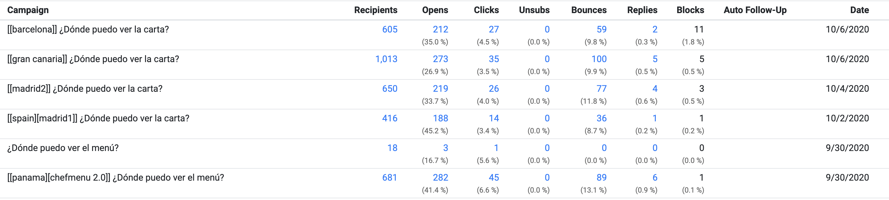

# Chefmenu 2.0

Digital online menu for restaurants and bars.

### Work Summary

**1769 lines** of code written

**136 hours** of work

### Biz data

Email:

> ¡Hola!
> 
> Apuesto que la carta digital con código QR que tienen no sirve bien. ¿Por qué? Porque los clientes podrían gastar mucho más con una web de clase mundial que les > hace descubrir todo lo que ofrece su local.
> 
> ¿Cómo sería esa web? ASÍ
> 
> ¡Ahora lo pueden tener para siempre sin compromiso y GRATIS AQUÍ!
> 
> Un saludo,
> 
> Tomás Baran
> Director general y fundador
> ChefMenu

**Emails sent** &nbsp; &nbsp; &nbsp; &nbsp; &nbsp; &nbsp; &nbsp; &nbsp; ->&nbsp; &nbsp; &nbsp; &nbsp; &nbsp; &nbsp; **Opens** &nbsp; &nbsp; &nbsp; &nbsp; &nbsp; &nbsp; &nbsp; &nbsp; &nbsp; &nbsp;-> &nbsp; &nbsp; &nbsp; &nbsp; &nbsp;&nbsp; &nbsp; &nbsp; &nbsp; &nbsp; &nbsp; &nbsp; **Click** &nbsp; &nbsp; &nbsp; &nbsp; &nbsp; &nbsp; -> &nbsp; &nbsp; &nbsp; &nbsp; &nbsp; &nbsp; **Registrations**

    3383            35%      1177           13%        148(4.4%)     6.8%     10(0.3%)      

#### Panama

**Emails sent** &nbsp; &nbsp; &nbsp; &nbsp; &nbsp; &nbsp; &nbsp; &nbsp; ->&nbsp; &nbsp; &nbsp; &nbsp; &nbsp; &nbsp; **Opens** &nbsp; &nbsp; &nbsp; &nbsp; &nbsp; &nbsp; &nbsp; &nbsp; &nbsp; &nbsp;-> &nbsp; &nbsp; &nbsp; &nbsp; &nbsp;&nbsp; &nbsp; &nbsp; &nbsp; &nbsp; &nbsp; &nbsp; **Click** &nbsp; &nbsp; &nbsp; &nbsp; &nbsp; &nbsp; -> &nbsp; &nbsp; &nbsp; &nbsp; &nbsp; &nbsp; **Registrations**

    699            40%      285           16%           46(6.6%)      13%     6(0.9%)  
    
#### Madrid (ES)

**Emails sent** &nbsp; &nbsp; &nbsp; &nbsp; &nbsp; &nbsp; &nbsp; &nbsp; ->&nbsp; &nbsp; &nbsp; &nbsp; &nbsp; &nbsp; **Opens** &nbsp; &nbsp; &nbsp; &nbsp; &nbsp; &nbsp; &nbsp; &nbsp; &nbsp; &nbsp;-> &nbsp; &nbsp; &nbsp; &nbsp; &nbsp;&nbsp; &nbsp; &nbsp; &nbsp; &nbsp; &nbsp; &nbsp; **Click** &nbsp; &nbsp; &nbsp; &nbsp; &nbsp; &nbsp; -> &nbsp; &nbsp; &nbsp; &nbsp; &nbsp; &nbsp; **Registrations**

    1066            38%      407            10%         40(3.8%)     2.5%     1(0.1%)  
    
#### Gran Canaria (ES)

**Emails sent** &nbsp; &nbsp; &nbsp; &nbsp; &nbsp; &nbsp; &nbsp; &nbsp; ->&nbsp; &nbsp; &nbsp; &nbsp; &nbsp; &nbsp; **Opens** &nbsp; &nbsp; &nbsp; &nbsp; &nbsp; &nbsp; &nbsp; &nbsp; &nbsp; &nbsp;-> &nbsp; &nbsp; &nbsp; &nbsp; &nbsp;&nbsp; &nbsp; &nbsp; &nbsp; &nbsp; &nbsp; &nbsp; **Click** &nbsp; &nbsp; &nbsp; &nbsp; &nbsp; &nbsp; -> &nbsp; &nbsp; &nbsp; &nbsp; &nbsp; &nbsp; **Registrations**

    1013            27%      273            13%          35(3.5%)     2.9%     1(0.1%)  
    
#### Barcelona (ES)

**Emails sent** &nbsp; &nbsp; &nbsp; &nbsp; &nbsp; &nbsp; &nbsp; &nbsp; ->&nbsp; &nbsp; &nbsp; &nbsp; &nbsp; &nbsp; **Opens** &nbsp; &nbsp; &nbsp; &nbsp; &nbsp; &nbsp; &nbsp; &nbsp; &nbsp; &nbsp;-> &nbsp; &nbsp; &nbsp; &nbsp; &nbsp;&nbsp; &nbsp; &nbsp; &nbsp; &nbsp; &nbsp; &nbsp; **Click** &nbsp; &nbsp; &nbsp; &nbsp; &nbsp; &nbsp; -> &nbsp; &nbsp; &nbsp; &nbsp; &nbsp; &nbsp; **Registrations**

    605            35%      212             13%           27(4.5%)     7.4%     2(0.3%)  

